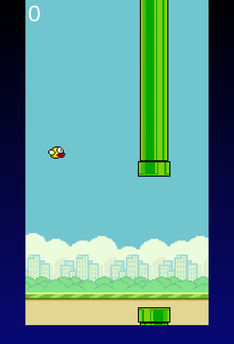

# Flappy Bird Game Clone

All the credit goes to Kenny Yip Coding on Youtube for providing the awesome tutorial to building this project!🌟

Coding Tutorial: https://youtu.be/jj5ADM2uywg

A simple browser-based Flappy Bird clone made with JavaScript.

## What I Learned

- Basic Game Development

- How to use HTML Canvas for drawing games
  -Creating a game loop that updates continuously
  -Loading and displaying images in a game

## Game Mechanics

- Adding gravity to make the bird fall
- Creating moving pipes
- Detecting when the bird hits something
- Keeping track of the score

## JavaScript Skills

- Working with arrays for the pipes
- Using objects to organize game data
- Handling keyboard inputs
  Basic collision detection

## Game Features

- Bird that responds to gravity
- Randomly placed pipes
- Score counter
- Game over screen
- Easy restart option
